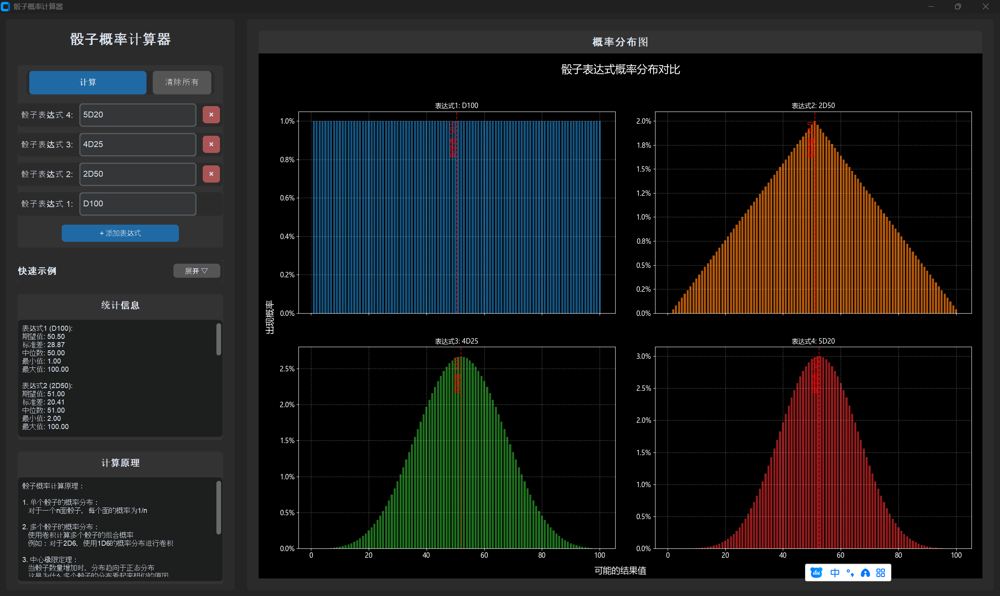

# 骰子概率计算器

**注意：** 本项目初版完全由Cursor编写，用于测试Cursor的独立编程能力，计算结果仅供参考。

这是一个用于计算骰子表达式概率分布的工具。支持类似 "2D20+80" 这样的表达式，其中：
- xDy 表示投掷 x 个 y 面骰子
- +n 表示加上修正值 n



## 功能特点

- 支持多个骰子的组合（如 "2D20+3D6+10"）
- 计算概率分布
- 显示统计信息（期望值、标准差、中位数等）
- 可视化概率分布图
- 图形用户界面

## 安装依赖

```bash
pip install -r requirements.txt
```

## 使用方法

### 1. 使用图形界面（推荐）

运行图形界面程序：
```bash
python dice_calculator_gui.py
```

在图形界面中：
1. 在输入框中输入骰子表达式（如 "2D20+80"）
2. 点击"计算"按钮
3. 查看统计信息和概率分布图

### 2. 使用命令行界面

运行主程序：
```bash
python dice_calculator.py
```

### 3. 在代码中使用

```python
from dice_calculator import DiceCalculator

calculator = DiceCalculator()

# 计算概率分布
x, prob = calculator.calculate_probability("2D20+80")

# 获取统计信息
stats = calculator.get_statistics("2D20+80")

# 绘制概率分布图
calculator.plot_probability("2D20+80")
```

## 示例输出

程序会显示：
- 统计信息（期望值、标准差、中位数、最小值和最大值）
- 概率分布图 